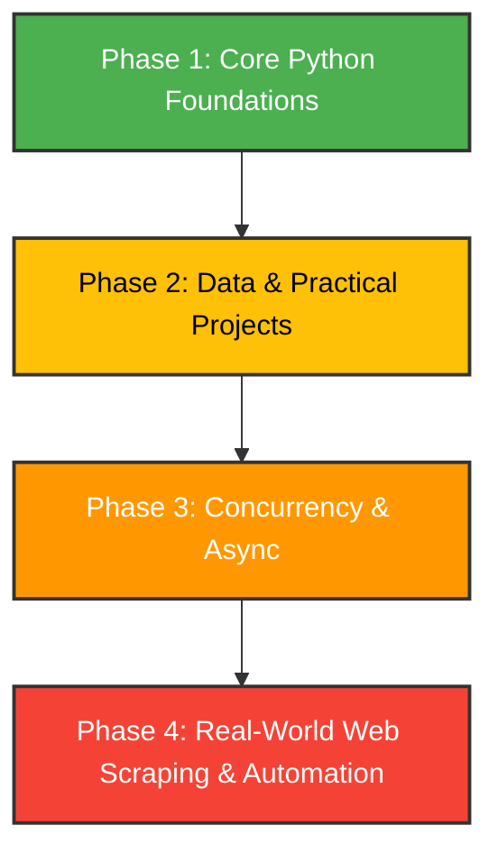

<div align="center">

# 🐍 Complete Python Boot Camp

[](https://www.python.org/)
[](#)
[](https://opensource.org/licenses/MIT)
[](https://jupyter.org/)

*From zero to advanced: A complete, self-paced, project-based curriculum.*

[**Start the Course**](./00_intro/getting_started.ipynb) • [**View Syllabus**](./SYLLABUS.md) • [**Setup Guide**](./SETUP.md)

</div>

---

## 📖 Welcome!

Welcome to this **Free Python Course**. This repository contains a structured, phase-by-phase learning path of Jupyter notebooks, standalone scripts, and real-world projects. It is designed to take you from writing your first line of Python to mastering advanced concepts like concurrency, web scraping, and automation.

---

## 🗺️ Course Roadmap



---

## 🚀 Quick Start

Get your environment ready and run your first notebook in under 5 minutes:

### 1. Clone & Set Up
```bash
# Clone the repository and navigate into it
git clone <repository-url>
cd python

# Create and activate a virtual environment
python3 -m venv .venv
source .venv/bin/activate  # On Windows: .venv\Scripts\activate
```

### 2. Install Dependencies
```bash
# Upgrade pip and install the required libraries
python -m pip install --upgrade pip
pip install -r requirements.txt
```

### 3. Launch the Course
```bash
# Open Jupyter Notebook
jupyter notebook
```
*Open [`00_intro/getting_started.ipynb`](./00_intro/getting_started.ipynb) in your browser to begin Module 00!*

---

## 📂 Curriculum Overview

For a detailed lesson-by-lesson breakdown, check out the [**Syllabus (`SYLLABUS.md`)**](./SYLLABUS.md).

### 🟢 Phase 1: Core Python Foundations
Master the language syntax and programming fundamentals using interactive Jupyter notebooks:
*   [**Module 00: Intro & Orientation**](./00_intro/getting_started.ipynb) — Setting up the workspace and running Python.
*   [**Module 01: Python Basics**](./1.basics.ipynb) — Variables, data types, operators, conditionals, and loops.
*   [**Module 02: Intermediate Concepts**](./2.intermediate.ipynb) — Functions, scope, lambda expressions, map, and filter.
*   [**Module 03: Comprehensions**](./3.comprehension.ipynb) — Elegant list, dictionary, and set comprehensions.
*   [**Module 04: Generators**](./4.generaors.ipynb) — Lazy iteration, `yield`, and memory-efficient streaming.
*   [**Module 05: Decorators**](./5.Decorators.ipynb) — Higher-order functions, wrapping logic, and execution timing.
*   [**Module 06: Errors & Logging**](./6.ErrorNLog.ipynb) — Try/except blocks, custom exceptions, and structured log levels.
*   [**Module 07: OOP Foundations**](./7.OOPs1.ipynb) — Classes, objects, attributes, methods, and constructors.
*   [**Module 08: Inheritance**](./8.Inheritance.ipynb) — Code reuse, base and child classes, and `super()`.
*   [**Module 09: OOP Advanced**](./9.OOPs2.ipynb) — Polymorphism, special/dunder methods, and `@property` decorators.
*   [**Module 10: Pydantic Validation**](./10.%20PYDANTIC.ipynb) — Type checking, data parsing, and robust configuration.

---

### 🟡 Phase 2: Data & Practical Projects
Apply your foundation by building real CLI tools, handling data formats, and beginning your data science journey:
*   📁 [**Basic Projects**](./Basic_Projects/)
    *   [`ceaser-cipher.py`](./Basic_Projects/ceaser-cipher.py) — Encrypt and decrypt text messages.
    *   [`password-checkerr.py`](./Basic_Projects/password-checkerr.py) — Evaluate password strength using regex and heuristics.
    *   [`Terminal_Task_Manager.py`](./Basic_Projects/Terminal_Task_Manager.py) — Keep track of tasks in a terminal UI.
*   📁 [**Data Handling Projects**](./Data-Handling-Project/)
    *   [`CSV-TO-JSON.py`](./Data-Handling-Project/CSV-TO-JSON.py) — Convert data records between tabular and document format.
    *   [`JSON-Flattener.py`](./Data-Handling-Project/JSON-Flattener.py) — Flatten nested JSON objects into simple key-value structures.
    *   [`JSON-to-Excel.py`](./Data-Handling-Project/JSON-to-Excel.py) — Export complex datasets directly to spreadsheet formats.
    *   [`Real-TimeWeatherLogger.py`](./Data-Handling-Project/Real-TimeWeatherLogger.py) — Fetch, log, and parse real-time weather information from web APIs.
    *   [`StudentMarksAnalyzer.py`](./Data-Handling-Project/StudentMarksAnalyzer.py) — Analyze data records, computing averages, grades, and standard deviations.
    *   [`CLI_Contact_Book.py`](./Data-Handling-Project/CLI_Contact_Book.py) / [`Offline-Credential-Manager.py`](./Data-Handling-Project/Offline-Credential-Manager.py) / [`OfflineNotesLocker.py`](./Data-Handling-Project/OfflineNotesLocker.py) / [`PersonalMovieTracker.py`](./Data-Handling-Project/PersonalMovieTracker.py) — Local storage managers.
*   📁 [**Data Science Starter**](./Basic-Data-Science-Projects/)
    *   [`day_01.ipynb`](./Basic-Data-Science-Projects/day_01.ipynb) to [`day_05.py`](./Basic-Data-Science-Projects/day_05.py) — Practical exercises with NumPy and Pandas.
*   📁 [**Scientific Utilities**](./Scientic_func/)
    *   [`science.py`](./Scientic_func/science.py) — Math and scientific utility helpers.

---

### 🟠 Phase 3: Concurrency & Async
Learn how Python handles concurrent tasks under the hood:
*   📁 [**Asynchronous Python**](./Ascynchronous_Python/)
    *   Explore coroutines, event loops, and non-blocking background workers (`01_async_one.py` to `10_deadlock.py`).
*   📁 [**Threading & Concurrency**](./Thread_n_Concurrency/)
    *   Master OS threads, multi-processing, thread locks, queues, and explore GIL behavior (`01_threading.py` to `12_process_value.py`).

---

### 🔴 Phase 4: Real-World Skills
Harness Python to automate your desktop and pull data from the internet:
*   📁 [**Web Scraping**](./Web_Scrapping-Projects/)
    *   Extract structured information from Wikipedia, scrape top posts from Hacker News, download cover images, and build crypto price trackers (`Crypto_Price_Tracker-1.py` to `Scrape-Books.py`).
*   📁 [**Automation Tasks**](./Automation-Task/)
    *   Automate directory structures, build file sorters and batch renamers, and monitor system resources (`Auto-File-Sorter.py`, `System-Resource-Monitor.py`).

---

## 🛠️ Technology Stack

This course is built using the standard Python ecosystem along with production-grade libraries:

*   **Core Logic:** Python 3.10+
*   **Data Analysis:** Pandas, NumPy, OpenPyXL
*   **Data Validation:** Pydantic v2
*   **Scraping & Requesting:** BeautifulSoup4, Requests, urllib3
*   **Environment:** Jupyter Notebooks

---

## ✅ Progress Tracker

Use this checklist to track your personal course progress:

- [ ] **Phase 1: Core Python**
  - [ ] Module 00: Intro
  - [ ] Modules 01-03: Basics, Intermediate, & Comprehensions
  - [ ] Modules 04-06: Generators, Decorators, Errors & Logging
  - [ ] Modules 07-09: Object-Oriented Programming (OOP)
  - [ ] Module 10: Pydantic Validation
- [ ] **Phase 2: Projects & Data**
  - [ ] CLI/Cipher Tools
  - [ ] Data Format Converters (CSV, JSON, Excel)
  - [ ] NumPy/Pandas Exercises
- [ ] **Phase 3: Concurrency**
  - [ ] Async Programming (`asyncio`, event loop)
  - [ ] Threading, Multiprocessing, and Locks
- [ ] **Phase 4: Web & Automation**
  - [ ] Web Scraping (BeautifulSoup, Requests)
  - [ ] File and System Automation Scripts

---

## 🤝 Contributing

We welcome contributions of all kinds! Whether you are fixing a typo in a notebook or proposing a new automation script:

1.  **Fork** this repository.
2.  Create your **feature branch** (`git checkout -b feature/amazing-feature`).
3.  **Commit** your changes (`git commit -m 'Add some AmazingFeature'`).
4.  **Push** to the branch (`git push origin feature/amazing-feature`).
5.  Open a **Pull Request**!

*Happy Coding!* 🚀
